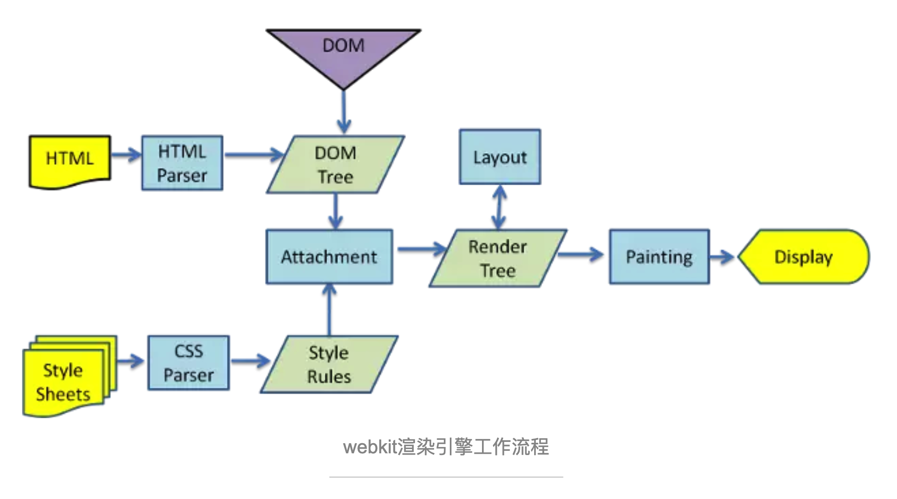

# 为什么使用Vue.js

https://api.myjson.com/bins/1h8gwt

https://api.myjson.com/bins/dx7m3


# Vue生命周期函数

Vue实例有一个完整的生命周期，也就是从开始创建、初始化数据、编译模板、挂载Dom、渲染→更新→渲染、销毁等一系列过程，我们称这是Vue的生命周期。通俗说就是Vue实例从创建到销毁的过程，就是生命周期。

每一个组件或者实例都会经历一个完整的生命周期，总共分为三个阶段：初始化、运行中、销毁。

1. 实例、组件通过new Vue() 创建出来之后会初始化事件和生命周期，然后就会执行beforeCreate钩子函数，这个时候，数据还没有挂载呢，只是一个空壳，无法访问到数据和真实的dom，一般不做操作
2. 挂载数据，绑定事件等等，然后执行created函数，这个时候已经可以使用到数据，也可以更改数据,在这里更改数据不会触发updated函数，在这里可以在渲染前倒数第二次更改数据的机会，不会触发其他的钩子函数，一般可以在这里做初始数据的获取
3. 接下来开始找实例或者组件对应的模板，编译模板为虚拟dom放入到render函数中准备渲染，然后执行beforeMount钩子函数，在这个函数中虚拟dom已经创建完成，马上就要渲染,在这里也可以更改数据，不会触发updated，在这里可以在渲染前最后一次更改数据的机会，不会触发其他的钩子函数，一般可以在这里做初始数据的获取
4. 接下来开始render，渲染出真实dom，然后执行mounted钩子函数，此时，组件已经出现在页面中，数据、真实dom都已经处理好了,事件都已经挂载好了，可以在这里操作真实dom等事情...
5. 当组件或实例的数据更改之后，会立即执行beforeUpdate，然后vue的虚拟dom机制会重新构建虚拟dom与上一次的虚拟dom树利用diff算法进行对比之后重新渲染，一般不做什么事儿
6. 当更新完成后，执行updated，数据已经更改完成，dom也重新render完成，可以操作更新后的虚拟dom
7. 当经过某种途径调用$destroy方法后，立即执行beforeDestroy，一般在这里做一些善后工作，例如清除计时器、清除非指令绑定的事件等等
8. 组件的数据绑定、监听...去掉后只剩下dom空壳，这个时候，执行destroyed，在这里做善后工作也可以


# 虚拟DOM

##一、真实DOM和其解析流程

​    浏览器渲染引擎工作流程都差不多，大致分为5步，**创建DOM树——创建StyleRules——创建Render树——布局Layout——绘制Painting**

​    第一步，用HTML分析器，分析HTML元素，**构建一颗DOM树**(标记化和树构建)。

​    第二步，用CSS分析器，分析CSS文件和元素上的inline样式，生成页面的样式表。

​    第三步，将DOM树和样式表，关联起来，构建一颗Render树(这一过程又称为Attachment)。每个DOM节点都有**attach方法，接受样式信息**，返回一个render对象(又名renderer)。这些render对象最终会被构建成一颗Render树。

​    第四步，有了Render树，浏览器开始布局，为每个Render树上的节点确定一个在显示屏上出现的精确坐标。

​    第五步，Render树和节点显示坐标都有了，就调用每个节点**paint方法，把它们绘制**出来。 

​    **DOM树的构建是文档加载完成开始的？**构建DOM数是一个渐进过程，为达到更好用户体验，渲染引擎会尽快将内容显示在屏幕上。**它不必**等到整个HTML文档解析完毕之后才开始构建render树和布局。

​    **Render树是DOM树和CSSOM树构建完毕才开始构建的吗？**这三个过程在实际进行的时候又不是完全独立，而是会有交叉。会造成一边加载，一遍解析，一遍渲染的工作现象。

​    **CSS的解析是从右往左逆向解析的**(从DOM树的下－上解析比上－下解析效率高)，**嵌套标签越多，解析越慢。**




##二、JS操作真实DOM的代价！

​        用我们传统的开发模式，原生JS或JQ操作DOM时，浏览器会从构建DOM树开始从头到尾执行一遍流程。在一次操作中，我需要更新10个DOM节点，浏览器收到第一个DOM请求后并不知道还有9次更新操作，因此会马上执行流程，最终执行10次。例如，第一次计算完，紧接着下一个DOM更新请求，这个节点的坐标值就变了，前一次计算为无用功。计算DOM节点坐标值等都是白白浪费的性能。即使计算机硬件一直在迭代更新，操作DOM的代价仍旧是昂贵的，频繁操作还是会出现页面卡顿，影响用户体验。

## 三、为什么需要虚拟DOM，它有什么好处?

​        Web界面由DOM树(树的意思是数据结构)来构建，当其中一部分发生变化时，其实就是对应某个DOM节点发生了变化。

​        虚拟DOM就是为了**解决浏览器性能问题**而被设计出来的。**如前**，若一次操作中有10次更新DOM的动作，虚拟DOM不会立即操作DOM，而是将这10次更新的diff内容保存到本地一个JS对象中，最终将这个JS对象一次性attch到DOM树上，再进行后续操作，避免大量无谓的计算量。**所以，**用JS对象模拟DOM节点的好处是，页面的更新可以先全部反映在JS对象(虚拟DOM)上，操作内存中的JS对象的速度显然要更快，等更新完成后，再将最终的JS对象映射成真实的DOM，交由浏览器去绘制。

## 四、实现虚拟DOM

​        例如一个真实的DOM节点。


真实DOM

​        我们用JS来模拟DOM节点实现虚拟DOM。


虚拟DOM

​        其中的Element方法具体怎么实现的呢？


Element方法实现

​        第一个参数是节点名（如div），第二个参数是节点的属性（如class），第三个参数是子节点（如ul的li）。除了这三个参数会被保存在对象上外，还保存了**key和count**。其相当于形成了虚拟DOM树。


虚拟DOM树

​        有了JS对象后，最终还需要将其映射成真实DOM


虚拟DOM对象映射成真实DOM

​        我们已经完成了创建虚拟DOM并将其映射成真实DOM，这样所有的更新都可以先反应到虚拟DOM上，如何反应？需要用到**Diff算法**。

​        两棵树如果完全比较时间复杂度是O(n^3)，但参照《深入浅出React和Redux》一书中的介绍，React的Diff算法的时间复杂度是O(n)。要实现这么低的时间复杂度，意味着只能平层的比较两棵树的节点，放弃了深度遍历。这样做，似乎牺牲掉了一定的精确性来换取速度，但考虑到现实中前端页面通常也不会跨层移动DOM元素，这样做是最优的。

###深度优先遍历，记录差异

###Diff操作

​        在实际代码中，会对新旧两棵树进行一个深度的遍历，每个节点都会有一个标记。每遍历到一个节点就把该节点和新的树进行对比，如果有差异就记录到一个对象中。

​        下面我们创建一棵新树，用于和之前的树进行比较，来看看Diff算法是怎么操作的。


​        平层Diff，只有以下4种情况：

​        1、**节点类型变了**，例如下图中的P变成了H3。我们将这个过程称之为**REPLACE**。直接将旧节点卸载并装载新节点。旧节点包括下面的子节点都将被卸载，如果新节点和旧节点仅仅是类型不同，但下面的所有子节点都一样时，这样做效率不高。但为了避免O(n^3)的时间复杂度，这样是值得的。这也提醒了开发者，应该避免无谓的节点类型的变化，例如运行时将div变成p没有意义。

​        2、**节点类型一样，仅仅属性或属性值变了。**我们将这个过程称之为**PROPS**。此时不会触发节点卸载和装载，而是节点更新。


查找不同属性方法

​        3、**文本变了**，文本对也是一个Text Node，也比较简单，直接修改文字内容就行了，我们将这个过程称之为**TEXT**。

​        4、移动／增加／删除 子节点，我们将这个过程称之为**REORDER**。看一个例子，在A、B、C、D、E五个节点的B和C中的BC两个节点中间加入一个F节点。


例子

​        我们**简单粗暴的做法**是遍历每一个新虚拟DOM的节点，与旧虚拟DOM对比相应节点对比，在旧DOM中是否存在，不同就卸载原来的按上新的。这样会对F后边每一个节点进行操作。卸载C，装载F，卸载D，装载C，卸载E，装载D，装载E。**效率太低。**


​        如果我们在JSX里为数组或枚举型元素增加上key后，它能够根据key，直接找到具体位置进行操作，效率比较高。常见的**最小编辑距离问题**，可以用Levenshtein Distance算法来实现，时间复杂度是O(M*N)，但通常我们只要一些简单的移动就能满足需要，降低精确性，将时间复杂度降低到O(max(M,N))即可。


###映射成真实DOM

​        虚拟DOM有了，Diff也有了，现在就可以将Diff应用到真实DOM上了。深度遍历DOM将Diff的内容更新进去。


根据Diff更新DOM

我们会有两个虚拟DOM(js对象，new/old进行比较diff)，用户交互我们操作数据变化new虚拟DOM，old虚拟DOM会映射成**实际DOM(**js对象生成的DOM文档)通过**DOM fragment**操作给浏览器渲染。当修改new虚拟DOM，会把newDOM和oldDOM通过diff算法比较，得出diff结果数据表(用4种变换情况表示)。再把diff结果表通过**DOM** **fragment**更新到**浏览器DOM**中。

虚拟DOM的存在的意义？vdom 的真正意义是为了实现跨平台，服务端渲染，以及提供一个性能还算不错 Dom 更新策略。vdom 让整个 mvvm 框架灵活了起来

Diff算法只是为了虚拟DOM比较替换效率更高，通过Diff算法得到diff算法结果数据表(需要进行哪些操作记录表)。原本要操作的DOM在vue这边还是要操作的，只不过用到了js的**DOM** **fragment**来操作dom（统一计算出所有变化后统一更新一次DOM）进行浏览器DOM一次性更新。其实**DOM** **fragment**我们不用平时发开也能用，但是这样程序员写业务代码就用把DOM操作放到fragment里，这就是框架的价值，程序员才能专注于写业务代码**。**


# Vue 2.0 的 virtual-dom 实现简析 

`virtual-dom`(后文简称`vdom`)的概念大规模的推广还是得益于`react`出现，`virtual-dom`也是`react`这个框架的非常重要的特性之一。相比于频繁的手动去操作`dom`而带来性能问题，`vdom`很好的将`dom`做了一层映射关系，进而将在我们本需要直接进行`dom`的一系列操作，映射到了操作`vdom`，而`vdom`上定义了关于真实`dom`的一些关键的信息，`vdom`完全是用`js`去实现，和宿主浏览器没有任何联系，此外得益于`js`的执行速度，将原本需要在真实`dom`进行的`创建节点`,`删除节点`,`添加节点`等一系列复杂的`dom`操作全部放到`vdom`中进行，这样就通过操作`vdom`来提高直接操作的`dom`的效率和性能。

`Vue`在`2.0`版本也引入了`vdom`。其`vdom`算法是基于[snabbdom算法](https://github.com/snabbdom/snabbdom)所做的修改。

在`Vue`的整个应用生命周期当中，每次需要更新视图的时候便会使用`vdom`。那么在`Vue`当中，`vdom`是如何和`Vue`这个框架融合在一起工作的呢？以及大家常常提到的`vdom`的`diff`算法又是怎样的呢？接下来就通过这篇文章简单的向大家介绍下`Vue`当中的`vdom`是如何去工作的。

首先，我们还是来看下`Vue`生命周期当中初始化的最后阶段：将`vm`实例挂载到`dom`上，源码在[src/core/instance/init.js](https://github.com/vuejs/vue/blob/dev/src/core/instance/init.js#L67-L70)

```
    Vue.prototype._init = function () {
        ...
        vm.$mount(vm.$options.el)  
        ...
    }   
```

实际上是调用了[src/core/instance/lifecycle.js](https://github.com/vuejs/vue/blob/dev/src/core/instance/lifecycle.js#L139-L202)中的`mountComponent`方法，
`mountComponent`函数的定义是：

```
export function mountComponent (
  vm: Component,
  el: ?Element,
  hydrating?: boolean
): Component {
  // vm.$el为真实的node
  vm.$el = el
  // 如果vm上没有挂载render函数
  if (!vm.$options.render) {
    // 空节点
    vm.$options.render = createEmptyVNode
  }
  // 钩子函数
  callHook(vm, 'beforeMount')

  let updateComponent
  /* istanbul ignore if */
  if (process.env.NODE_ENV !== 'production' && config.performance && mark) {
    ...
  } else {
    // updateComponent为监听函数, new Watcher(vm, updateComponent, noop)
    updateComponent = () => {
      // Vue.prototype._render 渲染函数
      // vm._render() 返回一个VNode
      // 更新dom
      // vm._render()调用render函数，会返回一个VNode，在生成VNode的过程中，会动态计算getter,同时推入到dep里面
      vm._update(vm._render(), hydrating)
    }
  }

  // 新建一个_watcher对象
  // vm实例上挂载的_watcher主要是为了更新DOM
  // vm/expression/cb
  vm._watcher = new Watcher(vm, updateComponent, noop)
  hydrating = false

  // manually mounted instance, call mounted on self
  // mounted is called for render-created child components in its inserted hook
  if (vm.$vnode == null) {
    vm._isMounted = true
    callHook(vm, 'mounted')
  }
  return vm
}
```

注意上面的代码中定义了一个`updateComponent`函数，这个函数执行的时候内部会调用`vm._update(vm._render(), hyddrating)`方法，其中`vm._render`方法会返回一个新的`vnode`，(关于`vm_render`是如何生成`vnode`的建议大家看看`vue`的关于`compile`阶段的代码)，然后传入`vm._update`方法后，就用这个新的`vnode`和老的`vnode`进行`diff`，最后完成`dom`的更新工作。那么`updateComponent`都是在什么时候去进行调用呢？

```
vm._watcher = new Watcher(vm, updateComponent, noop)
```

实例化一个`watcher`，在求值的过程中`this.value = this.lazy ? undefined : this.get()`，会调用`this.get()`方法，因此在实例化的过程当中`Dep.target`会被设为这个`watcher`，通过调用`vm._render()`方法生成新的`Vnode`并进行`diff`的过程中完成了模板当中变量依赖收集工作。即这个`watcher`被添加到了在模板当中所绑定变量的依赖当中。一旦`model`中的响应式的数据发生了变化，这些响应式的数据所维护的`dep`数组便会调用`dep.notify()`方法完成所有依赖遍历执行的工作，这里面就包括了视图的更新即`updateComponent`方法，它是在`mountComponent`中的定义的。

`updateComponent`方法的定义是：

```
updateComponent = () => {
  vm._update(vm._render(), hydrating)
}
```

完成视图的更新工作事实上就是调用了`vm._update`方法，这个方法接收的第一个参数是刚生成的`Vnode`，调用的`vm._update`方法([src/core/instance/lifecycle.js](https://github.com/vuejs/vue/blob/dev/src/core/instance/lifecycle.js#L50-L90))的定义是

```
Vue.prototype._update = function (vnode: VNode, hydrating?: boolean) {
    const vm: Component = this
    if (vm._isMounted) {
      callHook(vm, 'beforeUpdate')
    }
    const prevEl = vm.$el
    const prevVnode = vm._vnode
    const prevActiveInstance = activeInstance
    activeInstance = vm
    // 新的vnode
    vm._vnode = vnode
    // Vue.prototype.__patch__ is injected in entry points
    // based on the rendering backend used.
    // 如果需要diff的prevVnode不存在，那么就用新的vnode创建一个真实dom节点
    if (!prevVnode) {
      // initial render
      // 第一个参数为真实的node节点
      vm.$el = vm.__patch__(
        vm.$el, vnode, hydrating, false /* removeOnly */,
        vm.$options._parentElm,
        vm.$options._refElm
      )
    } else {
      // updates
      // 如果需要diff的prevVnode存在，那么首先对prevVnode和vnode进行diff,并将需要的更新的dom操作已patch的形式打到prevVnode上，并完成真实dom的更新工作
      vm.$el = vm.__patch__(prevVnode, vnode)
    }
    activeInstance = prevActiveInstance
    // update __vue__ reference
    if (prevEl) {
      prevEl.__vue__ = null
    }
    if (vm.$el) {
      vm.$el.__vue__ = vm
    }
    // if parent is an HOC, update its $el as well
    if (vm.$vnode && vm.$parent && vm.$vnode === vm.$parent._vnode) {
      vm.$parent.$el = vm.$el
    }
}
```

在这个方法当中最为关键的就是`vm.__patch__`方法，这也是整个`virtaul-dom`当中最为核心的方法，主要完成了`prevVnode`和`vnode`的`diff`过程并根据需要操作的`vdom`节点打`patch`，最后生成新的真实`dom`节点并完成视图的更新工作。

接下来就让我们看下`vm.__patch__`里面到底发生了什么：

```
    function patch (oldVnode, vnode, hydrating, removeOnly, parentElm, refElm) {
        // 当oldVnode不存在时
        if (isUndef(oldVnode)) {
            // 创建新的节点
            createElm(vnode, insertedVnodeQueue, parentElm, refElm)
        } else {
            const isRealElement = isDef(oldVnode.nodeType)
            if (!isRealElement && sameVnode(oldVnode, vnode)) {
            // patch existing root node
            // 对oldVnode和vnode进行diff，并对oldVnode打patch
            patchVnode(oldVnode, vnode, insertedVnodeQueue, removeOnly)
      } 
        }
    }
```

在对`oldVnode`和`vnode`类型判断中有个`sameVnode`方法，这个方法决定了是否需要对`oldVnode`和`vnode`进行`diff`及`patch`的过程。

```
function sameVnode (a, b) {
  return (
    a.key === b.key &&
    a.tag === b.tag &&
    a.isComment === b.isComment &&
    isDef(a.data) === isDef(b.data) &&
    sameInputType(a, b)
  )
}
```

**sameVnode会对传入的2个vnode进行基本属性的比较，只有当基本属性相同的情况下才认为这个2个vnode只是局部发生了更新，然后才会对这2个vnode进行diff，如果2个vnode的基本属性存在不一致的情况，那么就会直接跳过diff的过程，进而依据vnode新建一个真实的dom，同时删除老的dom节点。**

`vnode`基本属性的定义可以参见源码:[src/vdom/vnode.js](https://github.com/vuejs/vue/blob/dev/src/core/vdom/vnode.js#L4-L65)里面对于`vnode`的定义。

```
constructor (
    tag?: string,
    data?: VNodeData,         // 关于这个节点的data值，包括attrs,style,hook等
    children?: ?Array<VNode>, // 子vdom节点
    text?: string,        // 文本内容
    elm?: Node,           // 真实的dom节点
    context?: Component,  // 创建这个vdom的上下文
    componentOptions?: VNodeComponentOptions
  ) {
    this.tag = tag
    this.data = data
    this.children = children
    this.text = text
    this.elm = elm
    this.ns = undefined
    this.context = context
    this.functionalContext = undefined
    this.key = data && data.key
    this.componentOptions = componentOptions
    this.componentInstance = undefined
    this.parent = undefined
    this.raw = false
    this.isStatic = false
    this.isRootInsert = true
    this.isComment = false
    this.isCloned = false
    this.isOnce = false
  }

  // DEPRECATED: alias for componentInstance for backwards compat.
  /* istanbul ignore next */
  get child (): Component | void {
    return this.componentInstance
  }
}
```

每一个`vnode`都映射到一个真实的`dom`节点上。其中几个比较重要的属性:

- `tag` 属性即这个`vnode`的标签属性
- `data` 属性包含了最后渲染成真实`dom`节点后，节点上的`class`,`attribute`,`style`以及绑定的事件
- `children` 属性是`vnode`的子节点
- `text` 属性是文本属性
- `elm` 属性为这个`vnode`对应的真实`dom`节点
- `key` 属性是`vnode`的标记，在`diff`过程中可以提高`diff`的效率，后文有讲解

比如，我定义了一个`vnode`，它的数据结构是:

```
    {
        tag: 'div'
        data: {
            id: 'app',
            class: 'page-box'
        },
        children: [
            {
                tag: 'p',
                text: 'this is demo'
            }
        ]
    }
```

最后渲染出的实际的`dom`结构就是:

```
   <div id="app" class="page-box">
       <p>this is demo</p>
   </div>
```

让我们再回到`patch`函数当中，**在当oldVnode不存在的时候**，这个时候是`root节点`初始化的过程，因此调用了`createElm(vnode, insertedVnodeQueue, parentElm, refElm)`方法去创建一个新的节点。**而当oldVnode是vnode且sameVnode(oldVnode, vnode)2个节点的基本属性相同**，那么就进入了2个节点的`diff`过程。

`diff`的过程主要是通过调用`patchVnode`([src/core/vdom/patch.js](https://github.com/vuejs/vue/blob/dev/src/core/vdom/patch.js#L441))方法进行的:

```
function patchVnode(oldVnode, vnode, insertedVnodeQueue, removeOnly) {
    ...
}
if (isDef(data) && isPatchable(vnode)) {
      // cbs保存了hooks钩子函数: 'create', 'activate', 'update', 'remove', 'destroy'
      // 取出cbs保存的update钩子函数，依次调用，更新attrs/style/class/events/directives/refs等属性
      for (i = 0; i < cbs.update.length; ++i) cbs.update[i](oldVnode, vnode)
      if (isDef(i = data.hook) && isDef(i = i.update)) i(oldVnode, vnode)
    }
```

更新真实`dom`节点的`data`属性，相当于对`dom`节点进行了预处理的操作

接下来:

```
    ...
    const elm = vnode.elm = oldVnode.elm
    const oldCh = oldVnode.children
    const ch = vnode.children
    // 如果vnode没有文本节点
    if (isUndef(vnode.text)) {
      // 如果oldVnode的children属性存在且vnode的属性也存在
      if (isDef(oldCh) && isDef(ch)) {
        // updateChildren，对子节点进行diff
        if (oldCh !== ch) updateChildren(elm, oldCh, ch, insertedVnodeQueue, removeOnly)
      } else if (isDef(ch)) {
        // 如果oldVnode的text存在，那么首先清空text的内容
        if (isDef(oldVnode.text)) nodeOps.setTextContent(elm, '')
        // 然后将vnode的children添加进去
        addVnodes(elm, null, ch, 0, ch.length - 1, insertedVnodeQueue)
      } else if (isDef(oldCh)) {
        // 删除elm下的oldchildren
        removeVnodes(elm, oldCh, 0, oldCh.length - 1)
      } else if (isDef(oldVnode.text)) {
        // oldVnode有子节点，而vnode没有，那么就清空这个节点
        nodeOps.setTextContent(elm, '')
      }
    } else if (oldVnode.text !== vnode.text) {
      // 如果oldVnode和vnode文本属性不同，那么直接更新真是dom节点的文本元素
      nodeOps.setTextContent(elm, vnode.text)
    }
```

这其中的`diff`过程中又分了好几种情况，`oldCh`为`oldVnode`的子节点，`ch`为`Vnode`的子节点：

1. 首先进行文本节点的判断，若`oldVnode.text !== vnode.text`，那么就会直接进行文本节点的替换；
2. 在`vnode`没有文本节点的情况下，进入子节点的`diff`；
3. 当`oldCh`和`ch`都存在且不相同的情况下，调用`updateChildren`对子节点进行`diff`；
4. 若`oldCh`不存在，`ch`存在，首先清空`oldVnode`的文本节点，同时调用`addVnodes`方法将`ch`添加到`elm`真实`dom`节点当中；
5. 若`oldCh`存在，`ch`不存在，则删除`elm`真实节点下的`oldCh`子节点；
6. 若`oldVnode`有文本节点，而`vnode`没有，那么就清空这个文本节点。

这里着重分析下`updateChildren`([src/core/vdom/patch.js](https://github.com/vuejs/vue/blob/dev/src/core/vdom/patch.js#L366-L366))方法，它也是整个`diff`过程中最重要的环节:

```
function updateChildren (parentElm, oldCh, newCh, insertedVnodeQueue, removeOnly) {
    // 为oldCh和newCh分别建立索引，为之后遍历的依据
    let oldStartIdx = 0
    let newStartIdx = 0
    let oldEndIdx = oldCh.length - 1
    let oldStartVnode = oldCh[0]
    let oldEndVnode = oldCh[oldEndIdx]
    let newEndIdx = newCh.length - 1
    let newStartVnode = newCh[0]
    let newEndVnode = newCh[newEndIdx]
    let oldKeyToIdx, idxInOld, elmToMove, refElm
    
    // 直到oldCh或者newCh被遍历完后跳出循环
    while (oldStartIdx <= oldEndIdx && newStartIdx <= newEndIdx) {
      if (isUndef(oldStartVnode)) {
        oldStartVnode = oldCh[++oldStartIdx] // Vnode has been moved left
      } else if (isUndef(oldEndVnode)) {
        oldEndVnode = oldCh[--oldEndIdx]
      } else if (sameVnode(oldStartVnode, newStartVnode)) {
        patchVnode(oldStartVnode, newStartVnode, insertedVnodeQueue)
        oldStartVnode = oldCh[++oldStartIdx]
        newStartVnode = newCh[++newStartIdx]
      } else if (sameVnode(oldEndVnode, newEndVnode)) {
        patchVnode(oldEndVnode, newEndVnode, insertedVnodeQueue)
        oldEndVnode = oldCh[--oldEndIdx]
        newEndVnode = newCh[--newEndIdx]
      } else if (sameVnode(oldStartVnode, newEndVnode)) { // Vnode moved right
        patchVnode(oldStartVnode, newEndVnode, insertedVnodeQueue)
        canMove && nodeOps.insertBefore(parentElm, oldStartVnode.elm, nodeOps.nextSibling(oldEndVnode.elm))
        oldStartVnode = oldCh[++oldStartIdx]
        newEndVnode = newCh[--newEndIdx]
      } else if (sameVnode(oldEndVnode, newStartVnode)) { // Vnode moved left
        patchVnode(oldEndVnode, newStartVnode, insertedVnodeQueue)
        // 插入到老的开始节点的前面
        canMove && nodeOps.insertBefore(parentElm, oldEndVnode.elm, oldStartVnode.elm)
        oldEndVnode = oldCh[--oldEndIdx]
        newStartVnode = newCh[++newStartIdx]
      } else {
        // 如果以上条件都不满足，那么这个时候开始比较key值，首先建立key和index索引的对应关系
        if (isUndef(oldKeyToIdx)) oldKeyToIdx = createKeyToOldIdx(oldCh, oldStartIdx, oldEndIdx)
        idxInOld = isDef(newStartVnode.key) ? oldKeyToIdx[newStartVnode.key] : null
        // 如果idxInOld不存在
        // 1. newStartVnode上存在这个key,但是oldKeyToIdx中不存在
        // 2. newStartVnode上并没有设置key属性
        if (isUndef(idxInOld)) { // New element
          // 创建新的dom节点
          // 插入到oldStartVnode.elm前面
          // 参见createElm方法
          createElm(newStartVnode, insertedVnodeQueue, parentElm, oldStartVnode.elm)
          newStartVnode = newCh[++newStartIdx]
        } else {
          elmToMove = oldCh[idxInOld]
          /* istanbul ignore if */
          if (process.env.NODE_ENV !== 'production' && !elmToMove) {
            warn(
              'It seems there are duplicate keys that is causing an update error. ' +
              'Make sure each v-for item has a unique key.'
            )
          
          // 将找到的key一致的oldVnode再和newStartVnode进行diff
          if (sameVnode(elmToMove, newStartVnode)) {
            patchVnode(elmToMove, newStartVnode, insertedVnodeQueue)
            oldCh[idxInOld] = undefined
            // 移动node节点
            canMove && nodeOps.insertBefore(parentElm, newStartVnode.elm, oldStartVnode.elm)
            newStartVnode = newCh[++newStartIdx]
          } else {
            // same key but different element. treat as new element
            // 创建新的dom节点
            createElm(newStartVnode, insertedVnodeQueue, parentElm, oldStartVnode.elm)
            newStartVnode = newCh[++newStartIdx]
          }
        }
      }
    }
    // 如果最后遍历的oldStartIdx大于oldEndIdx的话
    if (oldStartIdx > oldEndIdx) {        // 如果是老的vdom先被遍历完
      refElm = isUndef(newCh[newEndIdx + 1]) ? null : newCh[newEndIdx + 1].elm
      // 添加newVnode中剩余的节点到parentElm中
      addVnodes(parentElm, refElm, newCh, newStartIdx, newEndIdx, insertedVnodeQueue)
    } else if (newStartIdx > newEndIdx) { // 如果是新的vdom先被遍历完，则删除oldVnode里面所有的节点
      // 删除剩余的节点
      removeVnodes(parentElm, oldCh, oldStartIdx, oldEndIdx)
    }
}
```

在开始遍历`diff`前，首先给`oldCh`和`newCh`分别分配一个`startIndex`和`endIndex`来作为遍历的索引，当`oldCh`或者`newCh`遍历完后(遍历完的条件就是`oldCh`或者`newCh`的`startIndex >= endIndex`)，就停止`oldCh`和`newCh`的`diff`过程。接下来通过实例来看下整个`diff`的过程(节点属性中不带`key`的情况):

1. 首先从第一个节点开始比较，不管是`oldCh`还是`newCh`的起始或者终止节点都不存在`sameVnode`，同时节点属性中是不带`key`标记的，因此第一轮的`diff`完后，`newCh`的`startVnode`被添加到`oldStartVnode`的前面，同时`newStartIndex`前移一位；
   [](https://user-images.githubusercontent.com/9695264/27948439-63c3fb00-632c-11e7-95ae-425fac8ffc81.jpeg)
2. 第二轮的`diff`中，满足`sameVnode(oldStartVnode, newStartVnode)`，因此对这2个`vnode`进行`diff`，最后将`patch`打到`oldStartVnode`上，同时`oldStartVnode`和`newStartIndex`都向前移动一位
   [](https://user-images.githubusercontent.com/9695264/27948452-6c0acbf4-632c-11e7-85a9-d5cc9585d051.jpeg)
3. 第三轮的`diff`中，满足`sameVnode(oldEndVnode, newStartVnode)`，那么首先对`oldEndVnode`和`newStartVnode`进行`diff`，并对`oldEndVnode`进行`patch`，并完成`oldEndVnode`移位的操作，最后`newStartIndex`前移一位，`oldStartVnode`后移一位；
   [](https://user-images.githubusercontent.com/9695264/27948460-73c6d6da-632c-11e7-88f4-2887c72e740f.jpeg)
4. 第四轮的`diff`中，过程同步骤3；
   [](https://user-images.githubusercontent.com/9695264/27948473-7d83ab1c-632c-11e7-8eb7-c0d79e606355.jpeg)
5. 第五轮的`diff`中，同过程1；
   [](https://user-images.githubusercontent.com/9695264/27948477-84de867a-632c-11e7-9856-93202e96525f.jpeg)
6. 遍历的过程结束后，`newStartIdx > newEndIdx`，说明此时`oldCh`存在多余的节点，那么最后就需要将这些多余的节点删除。
   [](https://user-images.githubusercontent.com/9695264/27948481-89cf9b10-632c-11e7-8044-6fe70870fd43.jpg)

在`vnode`不带`key`的情况下，每一轮的`diff`过程当中都是`起始`和`结束`节点进行比较，直到`oldCh`或者`newCh`被遍历完。而当为`vnode`引入`key`属性后，在每一轮的`diff`过程中，当`起始`和`结束`节点都没有找到`sameVnode`时，首先对`oldCh`中进行`key`值与索引的映射:

```
if (isUndef(oldKeyToIdx)) oldKeyToIdx = createKeyToOldIdx(oldCh, oldStartIdx, oldEndIdx)
idxInOld = isDef(newStartVnode.key) ? oldKeyToIdx[newStartVnode.key] : null
```

`createKeyToOldIdx`([src/core/vdom/patch.js](https://github.com/vuejs/vue/blob/dev/src/core/vdom/patch.js#L61-L69))方法，用以将`oldCh`中的`key`属性作为`键`，而对应的节点的索引作为`值`。然后再判断在`newStartVnode`的属性中是否有`key`，且是否在`oldKeyToIndx`中找到对应的节点。

1. 如果不存在这个`key`，那么就将这个`newStartVnode`作为新的节点创建且插入到原有的`root`的子节点中:

```
if (isUndef(idxInOld)) { // New element
    // 创建新的dom节点
    // 插入到oldStartVnode.elm前面
    // 参见createElm方法
    createElm(newStartVnode, insertedVnodeQueue, parentElm, oldStartVnode.elm)
         newStartVnode = newCh[++newStartIdx]
    } 
```

1. 如果存在这个`key`，那么就取出`oldCh`中的存在这个`key`的`vnode`，然后再进行`diff`的过程:

```
       elmToMove = oldCh[idxInOld]
          /* istanbul ignore if */
          if (process.env.NODE_ENV !== 'production' && !elmToMove) {
          
          // 将找到的key一致的oldVnode再和newStartVnode进行diff
          if (sameVnode(elmToMove, newStartVnode)) {
            patchVnode(elmToMove, newStartVnode, insertedVnodeQueue)
            // 清空这个节点
            oldCh[idxInOld] = undefined
            // 移动node节点
            canMove && nodeOps.insertBefore(parentElm, newStartVnode.elm, oldStartVnode.elm)
            newStartVnode = newCh[++newStartIdx]
          } else {
            // same key but different element. treat as new element
            // 创建新的dom节点
            createElm(newStartVnode, insertedVnodeQueue, parentElm, oldStartVnode.elm)
            newStartVnode = newCh[++newStartIdx]
          }
```

通过以上分析，给`vdom`上添加`key`属性后，遍历`diff`的过程中，当`起始点`, `结束点`的`搜寻`及`diff`出现还是无法匹配的情况下时，就会用`key`来作为唯一标识，来进行`diff`，这样就可以提高`diff`效率。

带有`Key`属性的`vnode`的`diff`过程可见下图：

注意在第一轮的`diff`过后`oldCh`上的`B节点`被删除了，但是`newCh`上的`B节点`上`elm`属性保持对`oldCh`上`B节点`的`elm`引用。
[](https://user-images.githubusercontent.com/9695264/27948508-a2a583de-632c-11e7-8d96-e481b5b96dd1.jpeg)
[](https://user-images.githubusercontent.com/9695264/27948706-61acfda2-632d-11e7-9b6d-ff4691059767.jpeg)
[](https://user-images.githubusercontent.com/9695264/27948716-6984b524-632d-11e7-9017-e08cec1e4388.jpeg)
[](https://user-images.githubusercontent.com/9695264/27948726-71d7cf0e-632d-11e7-8415-202607af560d.jpeg)
[](https://user-images.githubusercontent.com/9695264/27948742-7dbc0114-632d-11e7-9ff9-b8a1a3f88eb3.jpeg)


# Vue 双向绑定原理分析

当我们学习angular或者vue的时候，其双向绑定为我们开发带来了诸多便捷，今天我们就来分析一下vue双向绑定的原理。

**1.vue双向绑定原理**

vue.js 则是采用数据劫持结合发布者-订阅者模式的方式，通过`Object.defineProperty()`来劫持各个属性的`setter`，`getter`，在数据变动时发布消息给订阅者，触发相应的监听回调。我们先来看Object.defineProperty()这个方法：

```
var obj  = {};
Object.defineProperty(obj, 'name', {
        get: function() {
            console.log('我被获取了')
            return val;
        },
        set: function (newVal) {
            console.log('我被设置了')
        }
})
obj.name = 'fei';//在给obj设置name属性的时候，触发了set这个方法
var val = obj.name;//在得到obj的name属性，会触发get方法
```

已经了解到vue是通过数据劫持的方式来做数据绑定的，其中最核心的方法便是通过`Object.defineProperty()`来实现对属性的劫持，那么在设置或者获取的时候我们就可以在get或者set方法里加入其他的触发函数，达到监听数据变动的目的，无疑这个方法是本文中最重要、最基础的内容之一。

**2.实现最简单的双向绑定**

我们知道通过Object.defineProperty()可以实现数据劫持，使得属性在赋值的时候触发set方法，

```
<!doctype html>
<html lang="en">
<head>
    <meta charset="UTF-8">
    <title>Document</title>
</head>
<body>
    <div id="demo"></div>
    <input type="text" id="inp">
    <script>
        var obj  = {};
        var demo = document.querySelector('#demo')
        var inp = document.querySelector('#inp')
        Object.defineProperty(obj, 'name', {
            get: function() {
                return val;
            },
            set: function (newVal) {//当该属性被赋值的时候触发
                inp.value = newVal;
                demo.innerHTML = newVal;
            }
        })
        inp.addEventListener('input', function(e) {
            // 给obj的name属性赋值，进而触发该属性的set方法
            obj.name = e.target.value;
        });
        obj.name = 'fei';//在给obj设置name属性的时候，触发了set这个方法

				template: "<div v-text="aa"></div>"
    </script>
</body>
</html>
```

当然要是这么粗暴，肯定不行，性能会出很多的问题。

**3.讲解vue如何实现**

先看原理图


3.1 observer用来实现对每个vue中的data中定义的属性循环用Object.defineProperty()实现数据劫持，以便利用其中的setter和getter，然后通知订阅者，订阅者会触发它的update方法，对视图进行更新。

3.2 我们介绍为什么要订阅者，在vue中v-model，v-name，{{}}等都可以对数据进行显示，也就是说假如一个属性都通过这三个指令了，那么每当这个属性改变的时候，相应的这个三个指令的html视图也必须改变，于是vue中就是每当有这样的可能用到双向绑定的指令，就在一个Dep中增加一个订阅者，其订阅者只是更新自己的指令对应的数据，也就是v-model='name'和{{name}}有两个对应的订阅者，各自管理自己的地方。每当属性的set方法触发，就循环更新Dep中的订阅者。

**4.vue代码实现**

4.1 observer实现，主要是给每个vue的属性用Object.defineProperty()，代码如下：

```
function defineReactive (obj, key, val) {
    var dep = new Dep();
    Object.defineProperty(obj, key, {
      get: function() {
        //添加订阅者watcher到主题对象Dep
        if(Dep.target) {
          // JS的浏览器单线程特性，保证这个全局变量在同一时间内，只会有同一个监听器使用
          dep.addSub(Dep.target);
        }
        return val;
      },
      set: function (newVal) {
        if(newVal === val) return;
        val = newVal;
        console.log(val);
        // 作为发布者发出通知
        dep.notify();//通知后dep会循环调用各自的update方法更新视图
      }
   })
}

function observe(obj, vm) {
  Object.keys(obj).forEach(function(key) {
  	defineReactive(vm, key, obj[key]);
  })
}
```

4.2实现compile：

compile的目的就是解析各种指令成真正的html。

```
function Compile(node, vm) {
    if(node) {
        this.$frag = this.nodeToFragment(node, vm);
        return this.$frag;
    }
}
Compile.prototype = {
    nodeToFragment: function(node, vm) {
        var self = this;
        var frag = document.createDocumentFragment();
        var child;
        while(child = node.firstChild) {
            console.log([child])
            self.compileElement(child, vm);
            frag.append(child); // 将所有子节点添加到fragment中
        }
        return frag;
    },
    compileElement: function(node, vm) {
        var reg = /\{\{(.*)\}\}/;
        //节点类型为元素(input元素这里)
        if(node.nodeType === 1) {
            var attr = node.attributes;
            // 解析属性
            for(var i = 0; i < attr.length; i++ ) {
                if(attr[i].nodeName == 'v-model') {//遍历属性节点找到v-model的属性
                    var name = attr[i].nodeValue; // 获取v-model绑定的属性名
                    node.addEventListener('input', function(e) {
                        // 给相应的data属性赋值，进而触发该属性的set方法
                        vm[name]= e.target.value;
                    });
                    new Watcher(vm, node, name, 'value');//创建新的watcher，会触发函数向对应属性的dep数组中添加订阅者，
                }
            };
        }
        //节点类型为text
        if(node.nodeType === 3) {
            if(reg.test(node.nodeValue)) {
                var name = RegExp.$1; // 获取匹配到的字符串
                name = name.trim();
                new Watcher(vm, node, name, 'nodeValue');
            }
        }
    }
}
```

4.3 watcher实现

```
function Watcher(vm, node, name, type) {
    Dep.target = this;
    this.name = name;
    this.node = node;
    this.vm = vm;
    this.type = type;
    this.update();
    Dep.target = null;
}

Watcher.prototype = {
    update: function() {
        this.get();
        this.node[this.type] = this.value; // 订阅者执行相应操作
    },
    // 获取data的属性值
    get: function() {
        console.log(1)
        this.value = this.vm[this.name]; //触发相应属性的get
    }
}
```

4.4 实现Dep来为每个属性添加订阅者

```
function Dep() {
    this.subs = [];
}
Dep.prototype = {
    addSub: function(sub) {
        this.subs.push(sub);
    },
    notify: function() {
        this.subs.forEach(function(sub) {
        	sub.update();
        })
    }
}
```

这样一来整个数据的双向绑定就完成了。

**5.梳理**

首先我们为每个vue属性用Object.defineProperty()实现数据劫持，为每个属性分配一个订阅者集合的管理数组dep；然后在编译的时候在该属性的数组dep中添加订阅者，v-model会添加一个订阅者，{{}}也会，v-bind也会，只要用到该属性的指令理论上都会，接着为input会添加监听事件，修改值就会为该属性赋值，触发该属性的set方法，在set方法内通知订阅者数组dep，订阅者数组循环调用各订阅者的update方法更新视图。

简易vue源码地址：https://github.com/jiangzhenfei/simple-Vue


# Vue 2.0 的数据依赖实现原理简析

首先让我们从最简单的一个实例`Vue`入手:

```
    const app = new Vue({
        // options  传入一个选项obj.这个obj即对于这个vue实例的初始化
    })
```

通过查阅文档，我们可以知道这个`options`可以接受:

- 选项/数据
  - data
  - props
  - propsData(方便测试使用)
  - computed
  - methods
  - watch
- 选项 / DOM
- 选项 / 生命周期钩子
- 选项 / 资源
- 选项 / 杂项

具体未展开的内容请自行查阅相关文档，接下来让我们来看看传入的`选项/数据`是如何管理数据之间的相互依赖的。

```
    const app = new Vue({
        el: '#app',
        props: {
          a: {
            type: Object,
            default () {
              return {
                key1: 'a',
                key2: {
                    a: 'b'
                }
              }
            }
          }
        },
        data: {
          msg1: 'Hello world!',
          arr: {
            arr1: 1
          }
        },
        watch: {
          a (newVal, oldVal) {
            console.log(newVal, oldVal)
          }
        },
        methods: {
          go () {
            console.log('This is simple demo')
          }
        }
    })
```

我们使用`Vue`这个构造函数去实例化了一个`vue`实例`app`。传入了`props`, `data`, `watch`, `methods`等属性。在实例化的过程中，`Vue`提供的构造函数就使用我们传入的`options`去完成数据的依赖管理，初始化的过程只有一次，但是在你自己的程序当中，数据的依赖管理的次数不止一次。

那`Vue`的构造函数到底是怎么实现的呢？[Vue](https://github.com/vuejs/vue/blob/v2.1.10/src/core/instance/index.js)

```
// 构造函数
function Vue (options) {
  if (process.env.NODE_ENV !== 'production' &&
    !(this instanceof Vue)) {
    warn('Vue is a constructor and should be called with the `new` keyword')
  }
  this._init(options)
}

// 对Vue这个class进行mixin,即在原型上添加方法
// Vue.prototype.* = function () {}
initMixin(Vue)
stateMixin(Vue)
eventsMixin(Vue)
lifecycleMixin(Vue)
renderMixin(Vue)
```

当我们调用`new Vue`的时候，事实上就调用的`Vue`原型上的`_init`方法.

```
// 原型上提供_init方法,新建一个vue实例并传入options参数
  Vue.prototype._init = function (options?: Object) {
    const vm: Component = this
    // a uid
    vm._uid = uid++

    let startTag, endTag
    // a flag to avoid this being observed
    vm._isVue = true
    // merge options
    if (options && options._isComponent) {
      // optimize internal component instantiation
      // since dynamic options merging is pretty slow, and none of the
      // internal component options needs special treatment.
      initInternalComponent(vm, options)
    } else {
      // 将传入的这些options选项挂载到vm.$options属性上
      vm.$options = mergeOptions(
        // components/filter/directive
        resolveConstructorOptions(vm.constructor),
        // this._init()传入的options
        options || {},
        vm
      )
    }
    /* istanbul ignore else */
    if (process.env.NODE_ENV !== 'production') {
      initProxy(vm)
    } else {
      vm._renderProxy = vm
    }
    // expose real self
    vm._self = vm     // 自身的实例
    // 接下来所有的操作都是在这个实例上添加方法
    initLifecycle(vm)  // lifecycle初始化
    initEvents(vm)     // events初始化 vm._events, 主要是提供vm实例上的$on/$emit/$off/$off等方法
    initRender(vm)     // 初始化渲染函数,在vm上绑定$createElement方法
    callHook(vm, 'beforeCreate')  // 钩子函数的执行, beforeCreate
    initInjections(vm) // resolve injections before data/props
    initState(vm)      // Observe data添加对data的监听, 将data转化为getters/setters
    initProvide(vm) // resolve provide after data/props
    callHook(vm, 'created') // 钩子函数的执行, created

    // vm挂载的根元素
    if (vm.$options.el) {
      vm.$mount(vm.$options.el)
    }
  }
```

其中在`this._init()`方法中调用`initState(vm)`,完成对`vm`这个实例的数据的监听,也是本文所要展开说的具体内容。

```
export function initState (vm: Component) {
  // 首先在vm上初始化一个_watchers数组，缓存这个vm上的所有watcher
  vm._watchers = []
  // 获取options,包括在new Vue传入的，同时还包括了Vue所继承的options
  const opts = vm.$options
  // 初始化props属性
  if (opts.props) initProps(vm, opts.props)
  // 初始化methods属性
  if (opts.methods) initMethods(vm, opts.methods)
  // 初始化data属性
  if (opts.data) {
    initData(vm)
  } else {
    observe(vm._data = {}, true /* asRootData */)
  }
  // 初始化computed属性
  if (opts.computed) initComputed(vm, opts.computed)
  // 初始化watch属性
  if (opts.watch) initWatch(vm, opts.watch)
}
```

## initProps

我们在实例化`app`的时候，在构造函数里面传入的`options`中有`props`属性：

```
    props: {
      a: {
        type: Object,
        default () {
          return {
            key1: 'a',
            key2: {
                a: 'b'
            }
          }
        }
      }
    }
function initProps (vm: Component, propsOptions: Object) {
  // propsData主要是为了方便测试使用
  const propsData = vm.$options.propsData || {}
  // 新建vm._props对象，可以通过app实例去访问
  const props = vm._props = {}
  // cache prop keys so that future props updates can iterate using Array
  // instead of dynamic object key enumeration.
  // 缓存的prop key
  const keys = vm.$options._propKeys = []
  const isRoot = !vm.$parent
  // root instance props should be converted
  observerState.shouldConvert = isRoot
  for (const key in propsOptions) {
    // this._init传入的options中的props属性
    keys.push(key)
    // 注意这个validateProp方法，不仅完成了prop属性类型验证的，同时将prop的值都转化为了getter/setter,并返回一个observer
    const value = validateProp(key, propsOptions, propsData, vm)
   
    // 将这个key对应的值转化为getter/setter
      defineReactive(props, key, value)
    // static props are already proxied on the component's prototype
    // during Vue.extend(). We only need to proxy props defined at
    // instantiation here.
    // 如果在vm这个实例上没有key属性，那么就通过proxy转化为proxyGetter/proxySetter, 并挂载到vm实例上，可以通过app._props[key]这种形式去访问
    if (!(key in vm)) {
      proxy(vm, `_props`, key)
    }
  }
  observerState.shouldConvert = true
}
```

接下来看下`validateProp(key, propsOptions, propsData, vm)`方法内部到底发生了什么。

```
export function validateProp (
  key: string,
  propOptions: Object,    // $options.props属性
  propsData: Object,      // $options.propsData属性
  vm?: Component
): any {
  const prop = propOptions[key]
  // 如果在propsData测试props上没有缓存的key
  const absent = !hasOwn(propsData, key)
  let value = propsData[key]
  // 处理boolean类型的数据
  // handle boolean props
  if (isType(Boolean, prop.type)) {
    if (absent && !hasOwn(prop, 'default')) {
      value = false
    } else if (!isType(String, prop.type) && (value === '' || value === hyphenate(key))) {
      value = true
    }
  }
  // check default value
  if (value === undefined) {
    // default属性值，是基本类型还是function
    // getPropsDefaultValue见下面第一段代码
    value = getPropDefaultValue(vm, prop, key)
    // since the default value is a fresh copy,
    // make sure to observe it.
    const prevShouldConvert = observerState.shouldConvert
    observerState.shouldConvert = true
    // 将value的所有属性转化为getter/setter形式
    // 并添加value的依赖
    // observe方法的分析见下面第二段代码
    observe(value)
    observerState.shouldConvert = prevShouldConvert
  }
  if (process.env.NODE_ENV !== 'production') {
    assertProp(prop, key, value, vm, absent)
  }
  return value
}
// 获取prop的默认值
function getPropDefaultValue (vm: ?Component, prop: PropOptions, key: string): any {
  // no default, return undefined
  // 如果没有default属性的话，那么就返回undefined
  if (!hasOwn(prop, 'default')) {
    return undefined
  }
  const def = prop.default
  // the raw prop value was also undefined from previous render,
  // return previous default value to avoid unnecessary watcher trigger
  if (vm && vm.$options.propsData &&
    vm.$options.propsData[key] === undefined &&
    vm._props[key] !== undefined) {
    return vm._props[key]
  }
  // call factory function for non-Function types
  // a value is Function if its prototype is function even across different execution context
  // 如果是function 则调用def.call(vm)
  // 否则就返回default属性对应的值
  return typeof def === 'function' && getType(prop.type) !== 'Function'
    ? def.call(vm)
    : def
}
```

`Vue`提供了一个`observe`方法,在其内部实例化了一个`Observer`类，并返回`Observer`的实例。每一个`Observer`实例对应记录了`props`中这个的`default value`的所有依赖(仅限`object`类型)，这个`Observer`实际上就是一个观察者，它维护了一个数组`this.subs = []`用以收集相关的`subs(订阅者)`(即这个观察者的依赖)。通过将`default value`转化为`getter/setter`形式，同时添加一个自定义`__ob__`属性，这个属性就对应`Observer`实例。

说起来有点绕，还是让我们看看我们给的`demo`里传入的`options`配置:

```
    props: {
      a: {
        type: Object,
        default () {
          return {
            key1: 'a',
            key2: {
                a: 'b'
            }
          }
        }
      }
    }
```

在往上数的第二段代码里面的方法`obervse(value)`，即对`{key1: 'a', key2: {a: 'b'}}`进行依赖的管理，同时将这个`obj`所有的属性值都转化为`getter/setter`形式。此外，`Vue`还会将`props`属性都代理到`vm`实例上，通过`vm.a`就可以访问到这个属性。

此外，还需要了解下在`Vue`中管理依赖的一个非常重要的类: `Dep`

```
export default class Dep { 
  constructor () {
    this.id = uid++
    this.subs = []
  }
  addSub () {...}  // 添加订阅者(依赖)
  removeSub () {...}  // 删除订阅者(依赖)
  depend () {...}  // 检查当前Dep.target是否存在以及判断这个watcher已经被添加到了相应的依赖当中，如果没有则添加订阅者(依赖)，如果已经被添加了那么就不做处理
  notify () {...}  // 通知订阅者(依赖)更新
}
```

在`Vue`的整个生命周期当中，你所定义的响应式的数据上都会绑定一个`Dep`实例去管理其依赖。它实际上就是`观察者`和`订阅者`联系的一个桥梁。

刚才谈到了对于依赖的管理，它的核心之一就是观察者`Observer`这个类：

```
export class Observer {
  value: any;
  dep: Dep;
  vmCount: number; // number of vms that has this object as root $data

  constructor (value: any) {
    this.value = value
    // dep记录了和这个value值的相关依赖
    this.dep = new Dep()
    this.vmCount = 0
    // value其实就是vm._data, 即在vm._data上添加__ob__属性
    def(value, '__ob__', this)
    // 如果是数组
    if (Array.isArray(value)) {
      // 首先判断是否能使用__proto__属性
      const augment = hasProto
        ? protoAugment
        : copyAugment
      augment(value, arrayMethods, arrayKeys)
      // 遍历数组，并将obj类型的属性改为getter/setter实现
      this.observeArray(value)
    } else {
      // 遍历obj上的属性，将每个属性改为getter/setter实现
      this.walk(value)
    }
  }

  /**
   * Walk through each property and convert them into
   * getter/setters. This method should only be called when
   * value type is Object.
   */
  // 将每个property对应的属性都转化为getter/setters,只能是当这个value的类型为Object时
  walk (obj: Object) {
    const keys = Object.keys(obj)
    for (let i = 0; i < keys.length; i++) {
      defineReactive(obj, keys[i], obj[keys[i]])
    }
  }

  /**
   * Observe a list of Array items.
   */
  // 监听array中的item
  observeArray (items: Array<any>) {
    for (let i = 0, l = items.length; i < l; i++) {
      observe(items[i])
    }
  }
}
```

`walk`方法里面调用`defineReactive`方法：通过遍历这个`object`的`key`，并将对应的`value`转化为`getter/setter`形式，通过闭包维护一个`dep`，在`getter`方法当中定义了这个`key`是如何进行依赖的收集，在`setter`方法中定义了当这个`key`对应的值改变后，如何完成相关依赖数据的更新。但是从源码当中，我们却发现当`getter`函数被调用的时候并非就一定会完成依赖的收集，其中还有一层判断，就是`Dep.target`是否存在。

```
/**
 * Define a reactive property on an Object.
 */
export function defineReactive (
  obj: Object,
  key: string,
  val: any,
  customSetter?: Function
) {
  // 每个属性新建一个dep实例，管理这个属性的依赖
  const dep = new Dep()
    
  // 或者属性描述符
  const property = Object.getOwnPropertyDescriptor(obj, key)
  // 如果这个属性是不可配的，即无法更改
  if (property && property.configurable === false) {
    return
  }

  // cater for pre-defined getter/setters
  const getter = property && property.get
  const setter = property && property.set

  // 递归去将val转化为getter/setter
  // childOb将子属性也转化为Observer
  let childOb = observe(val)
  Object.defineProperty(obj, key, {
    enumerable: true,
    configurable: true,
    // 定义getter -->> reactiveGetter
    get: function reactiveGetter () {
      const value = getter ? getter.call(obj) : val
      // 定义相应的依赖
      if (Dep.target) {
        // Dep.target.addDep(this)
        // 即添加watch函数
        // dep.depend()及调用了dep.addSub()只不过中间需要判断是否这个id的dep已经被包含在内了
        dep.depend()
        // childOb也添加依赖
        if (childOb) {
          childOb.dep.depend()
        }
        if (Array.isArray(value)) {
          dependArray(value)
        }
      }
      return value
    },
    // 定义setter -->> reactiveSetter
    set: function reactiveSetter (newVal) {
      const value = getter ? getter.call(obj) : val
      /* eslint-disable no-self-compare */
      if (newVal === value || (newVal !== newVal && value !== value)) {
        return
      }
      if (setter) {
        setter.call(obj, newVal)
      } else {
        val = newVal
      }
      // 对得到的新值进行observe
      childOb = observe(newVal)
      // 相应的依赖进行更新
      dep.notify()
    }
  })
}
```

在上文中提到了`Dep`类是链接`观察者`和`订阅者`的桥梁。同时在`Dep`的实现当中还有一个非常重要的属性就是`Dep.target`，它事实就上就是一个订阅者，只有当`Dep.target`(订阅者)存在的时候，调用属性的`getter`函数的时候才能完成依赖的收集工作。

```
Dep.target = null
const targetStack = []

export function pushTarget (_target: Watcher) {
  if (Dep.target) targetStack.push(Dep.target)
  Dep.target = _target
}

export function popTarget () {
  Dep.target = targetStack.pop()
}
```

那么`Vue`是如何来实现`订阅者`的呢？`Vue`里面定义了一个类: `Watcher`，在`Vue`的整个生命周期当中，会有4类地方会实例化`Watcher`：

- `Vue`实例化的过程中有`watch`选项
- `Vue`实例化的过程中有`computed`计算属性选项
- `Vue`原型上有挂载`$watch`方法: Vue.prototype.$watch，可以直接通过实例调用`this.$watch`方法
- `Vue`生成了`render`函数，更新视图时

```
constructor (
    vm: Component,
    expOrFn: string | Function,
    cb: Function,
    options?: Object
  ) {
    // 缓存这个实例vm
    this.vm = vm
    // vm实例中的_watchers中添加这个watcher
    vm._watchers.push(this)
    // options
    if (options) {
      this.deep = !!options.deep
      this.user = !!options.user
      this.lazy = !!options.lazy
      this.sync = !!options.sync
    } else {
      this.deep = this.user = this.lazy = this.sync = false
    }
    this.cb = cb
    this.id = ++uid // uid for batching
    this.active = true
    this.dirty = this.lazy // for lazy watchers
    ....
    // parse expression for getter
    if (typeof expOrFn === 'function') {
      this.getter = expOrFn
    } else {
      this.getter = parsePath(expOrFn)
      if (!this.getter) {
        this.getter = function () {}
      }
    }
    // 通过get方法去获取最新的值
    // 如果lazy为true, 初始化的时候为undefined
    this.value = this.lazy
      ? undefined
      : this.get()
  }
  get () {...}
  addDep () {...}
  update () {...}
  run () {...}
  evaluate () {...}
  run () {...}
```

`Watcher`接收的参数当中`expOrFn`定义了用以获取`watcher`的`getter`函数。`expOrFn`可以有2种类型：`string`或`function`.若为`string`类型，首先会通过`parsePath`方法去对`string`进行分割(仅支持`.`号形式的对象访问)。在除了`computed`选项外，其他几种实例化`watcher`的方式都是在实例化过程中完成求值及依赖的收集工作：`this.value = this.lazy ? undefined : this.get()`.在`Watcher`的`get`方法中:

**!!!前方高能**

```
get () {
 // pushTarget即设置当前的需要被执行的watcher
    pushTarget(this)
    let value
    const vm = this.vm
    if (this.user) {
      try {
        // $watch(function () {})
        // 调用this.getter的时候，触发了属性的getter函数
        // 在getter中进行了依赖的管理
        value = this.getter.call(vm, vm)
        console.log(value)
      } catch (e) {
        handleError(e, vm, `getter for watcher "${this.expression}"`)
      }
    } else {
      // 如果是新建模板函数，则会动态计算模板与data中绑定的变量，这个时候就调用了getter函数，那么就完成了dep的收集
      // 调用getter函数，则同时会调用函数内部的getter的函数，进行dep收集工作
      value = this.getter.call(vm, vm)
    }
    // "touch" every property so they are all tracked as
    // dependencies for deep watching
    // 让每个属性都被作为dependencies而tracked, 这样是为了deep watching
    if (this.deep) {
      traverse(value)
    }
    popTarget()
    this.cleanupDeps()
    return value    
}
```

一进入`get`方法，首先进行`pushTarget(this)`的操作，此时`Vue`当中`Dep.target = 当前这个watcher`,接下来进行`value = this.getter.call(vm, vm)`操作，在这个操作中就完成了依赖的收集工作。还是拿文章一开始的`demo`来说，在`vue`实例化的时候传入了`watch`选项：

```
    props: {
      a: {
        type: Object,
        default () {
          return {
            key1: 'a',
            key2: {
                a: 'b'
            }
          }
        }
      }
    },
   watch: {
        a (newVal, oldVal) {
            console.log(newVal, oldVal)
        }
    }, 
```

在`Vue`的`initState()`开始执行后，首先会初始化`props`的属性为`getter/setter`函数，然后在进行`initWatch`初始化的时候，这个时候初始化`watcher`实例，并调用`get()`方法，设置`Dep.target = 当前这个watcher实例`，进而到`value = this.getter.call(vm, vm)`的操作。在调用`this.getter.call(vm, vm)`的方法中，便会访问`props`选项中的`a`属性即其`getter`函数。在`a`属性的`getter`函数执行过程中，因为`Dep.target`已经存在，那么就进入了`依赖收集`的过程:

```
if (Dep.target) {
    // Dep.target.addDep(this)
    // 即添加watch函数
    // dep.depend()及调用了dep.addSub()只不过中间需要判断是否这个id的dep已经被包含在内了
    dep.depend()
    // childOb也添加依赖
    if (childOb) {
      childOb.dep.depend()
    }
    if (Array.isArray(value)) {
      dependArray(value)
    }
  }
```

`dep`是一开始初始化的过程中，这个属性上的`dep`属性。调用`dep.depend()`函数：

```
  depend () {
    if (Dep.target) {
      // Dep.target为一个watcher
      Dep.target.addDep(this)
    }
  }
```

`Dep.target`也就刚才的那个`watcher`实例，这里也就相当于调用了`watcher`实例的`addDep`方法: `watcher.addDep(this)`，并将`dep`观察者传入。在`addDep`方法中完成依赖收集:

```
addDep (dep: Dep) {
    const id = dep.id
    if (!this.newDepIds.has(id)) {
      this.newDepIds.add(id)
      this.newDeps.push(dep)
      if (!this.depIds.has(id)) {
        dep.addSub(this)
      }
    }
  }
```

这个时候依赖完成了收集，当你去修改`a`属性的值时，会调用`a`属性的`setter`函数，里面会执行`dep.notify()`，它会遍历所有的订阅者，然后调用订阅者上的`update`函数。

`initData`过程和`initProps`类似，具体可参见源码。

## initComputed

以上就是在`initProps`过程中`Vue`是如何进行依赖收集的，`initData`的过程和`initProps`类似，下来再来看看`initComputed`的过程.
在`computed`属性初始化的过程当中，会为每个属性实例化一个`watcher`:

```
const computedWatcherOptions = { lazy: true }

function initComputed (vm: Component, computed: Object) {
  // 新建_computedWatchers属性
  const watchers = vm._computedWatchers = Object.create(null)

  for (const key in computed) {
    const userDef = computed[key]
    // 如果computed为funtion，即取这个function为getter函数
    // 如果computed为非function.则可以单独为这个属性定义getter/setter属性
    let getter = typeof userDef === 'function' ? userDef : userDef.get
    // create internal watcher for the computed property.
    // lazy属性为true
    // 注意这个地方传入的getter参数
    // 实例化的过程当中不去完成依赖的收集工作
    watchers[key] = new Watcher(vm, getter, noop, computedWatcherOptions)

    // component-defined computed properties are already defined on the
    // component prototype. We only need to define computed properties defined
    // at instantiation here.
    if (!(key in vm)) {
      defineComputed(vm, key, userDef)
    } 
  }
}
```

但是这个`watcher`在实例化的过程中，由于传入了`{lazy: true}`的配置选项，那么一开始是不会进行求值与依赖收集的: `this.value = this.lazy ? undefined : this.get()`.在`initComputed`的过程中，`Vue`会将`computed`属性定义到`vm`实例上，同时将这个属性定义为`getter/setter`。当你访问`computed`属性的时候调用`getter`函数：

```
function createComputedGetter (key) {
  return function computedGetter () {
    const watcher = this._computedWatchers && this._computedWatchers[key]
    if (watcher) {
      // 是否需要重新计算
      if (watcher.dirty) {
        watcher.evaluate()
      }
      // 管理依赖
      if (Dep.target) {
        watcher.depend()
      }
      return watcher.value
    }
  }
}
```

在`watcher`存在的情况下，首先判断`watcher.dirty`属性，这个属性主要是用于判断这个`computed`属性是否需要重新求值，因为在上一轮的依赖收集的过程当中，观察者已经将这个`watcher`添加到依赖数组当中了，如果观察者发生了变化，就会`dep.notify()`，通知所有的`watcher`，而对于`computed`的`watcher`接收到变化的请求后，会将`watcher.dirty = true`即表明观察者发生了变化，当再次调用`computed`属性的`getter`函数的时候便会重新计算，否则还是使用之前缓存的值。

## initWatch

`initWatch`的过程中其实就是实例化`new Watcher`完成观察者的依赖收集的过程，在内部的实现当中是调用了原型上的`Vue.prototype.$watch`方法。这个方法也适用于`vm`实例，即在`vm`实例内部调用`this.$watch`方法去实例化`watcher`，完成依赖的收集，同时监听`expOrFn`的变化。

总结：

以上就是在`Vue`实例初始化的过程中实现依赖管理的分析。大致的总结下就是：

- `initState`的过程中，将`props`,`computed`,`data`等属性通过`Object.defineProperty`来改造其`getter/setter`属性，并为每一个响应式属性实例化一个`observer`观察者。这个`observer`内部`dep`记录了这个响应式属性的所有依赖。
- 当响应式属性调用`setter`函数时，通过`dep.notify()`方法去遍历所有的依赖，调用`watcher.update()`去完成数据的动态响应。

这篇文章主要从初始化的数据层面上分析了`Vue`是如何管理依赖来到达数据的动态响应。下一篇文章来分析下`Vue`中模板中的指令和响应式数据是如何关联来实现由数据驱动视图，以及数据是如何响应视图变化的。


#深入阅读Vue.js源码

https://ustbhuangyi.github.io/vue-analysis/


# Nuxt

官网：https://zh.nuxtjs.org/

##路由与视图

###创建与运行基于 Nuxt.js 框架的 Vue.js 项目

npx create-nuxt-app gp-next

###自动生成路由

(1) 修改 index.vue路由, 浏览器直接访问


```
<template>
  <div class="container">
    <h1 class="display-1">
      List
    </h1>
  </div>
</template>
```

(2)在pages里创建movies文件夹，在movies里创建hello.vue,浏览器里直接访问：http://localhost:3000/hello
```
<template>
  <div class="container">
    <h1 class="display-1">
      hello
    </h1>
  </div>
</template>
```
###路由连接 nuxt-link
修改index.vue:

```
<template>
  <div class="container">
    <h1 class="display-1">
      <a href="/movies/hello">gp</a>
    </h1>
  </div>
</template>
```

浏览首页，点击连接，发现页面刷新了。使用nuxt-link可以防止页面刷新：
```
<template>
  <div class="container">
    <h1 class="display-1">
      <nuxt-link to="/movies/hello">gp</nuxt-link>
    </h1>
  </div>
</template>
```

###动态路由
动态路由通过 _ 开头的文件名来实现。在movies里新建_id.vue文件：

```
<template>
  <div class="container">
    <h1 class="display-1">
      {{ $route.params.id }}
    </h1>
  </div>
</template>
```

###验证路由里的参数：validate
通过validate函数验证参数，函数返回结果为布尔值：

```
<template>
  <div class="container">
    <h1 class="display-1">
      {{ $route.params.id }}
    </h1>
  </div>
</template>
<script>
export default {
  validate({ params }) {
    return /^\d+$/.test(params.id)
  }
}
</script>
```

###视图：应用模板
在项目根目录下创建 app.html:

```
<!DOCTYPE html>
<html {{ HTML_ATTRS }}>
  <head>
    {{ HEAD }}
  </head>
  <body>
    {{ APP }}
  </body>
</html>
```

###视图：默认布局
(1) 去掉index.vue里div的container, 在 layouts/default.vue 里的div上添加 class='container'
(2) 丰富default.vue文件：

###视图：自定义布局
(1) 在layouts目录下创建 fullscreen.vue 文件

```
<template>
  <div>
    <nuxt />
  </div>
</template>
```
(2) 在movies/hello.vue添加：
```
<script>
export default {
  layout: 'fullscreen'
}
</script>
```

##异步数据
###搭建假的RESTful接口（json-server）
(1) 准备json文件：http://m.maoyan.com/ajax/movieOnInfoList?token=, 改造一下，只保留movieList字段
(2) 启动：json-server -w assets/movies.json -p 3333

###载入页面初始数据（asyncData）
(1) 修改pages下的index.vue

```
<template>
  <div>
    <h1 class="display-1">
      正在热映
    </h1>
    <div 
      v-for="movie in movies"
      :key="movie.id"
    >
      {{ movie.nm }}
    </div>
  </div>
</template>

<script>
export default {
  async asyncData({ $axios }) {
    const movies = await $axios.$get('http://localhost:3333/movieList')
    return { movies }
  }
}
</script>
```

###动态路由上的初始数据
(1) 修改movies里的_id.vue

```
<template>
  <div class="container">
    <h1 class="display-3">
      {{ movie.nm }}
    </h1>
    <div>
      {{ movie.star }}
    </div>
    <div>
      {{ movie.showInfo }}
    </div>
  </div>
</template>

<script>
export default {
  validate({ params }) {
    return /^\d+$/.test(params.id)
  },

  async asyncData({ $axios, params }) {
    const movie = await $axios.$get(`http://localhost:3333/movieList/${params.id}`)
    return {
      movie
    }
  }
}
</script>
```

###错误处理：显示错误页面

```
async asyncData({ $axios, params, error }) {
    try {
      const movie = await $axios.$get(`http://localhost:3333/movieList/${params.id}`)
      return {
        movie
      }
    } catch (e) {
      error({ statusCode: 404, message: 'Movie not fount.'})
    }
  }
```

###重新设计内容页面
(1) 修改movies 下的index.vue

```
<template>
  <div>
    <h1 class="display-1 my-5">正在热映</h1>
    <div class="row justify-content-center">
      <div
        v-for="movie in movies"
        :key="movie.id"
        class="col-md-6"
      >
        <div class="card my-3">
          <nuxt-link :to="{ name: 'movies-id', params: { id: movie.id } }">
            
            <div class="card-body">
              <h5 class="card-title">{{ movie.nm }}</h5>
              <h6 class="card-subtitle mb-2 text-black-50">{{ movie.star }}</h6>
            </div>
          </nuxt-link>
        </div>
      </div>
    </div>
  </div>
</template>

<script>
export default {
  async asyncData({ $axios }) {
    const movies = await $axios.$get('http://localhost:3333/movieList')
    return { movies }
  }
}
</script>
```

(2) 修改movies 下的_id.vue
```
<template>
  <div class="my-5">
    <h1 class="display-3 my-5">
      {{ movie.nm }}
    </h1>
    
    <div>
      {{ movie.star }}
    </div>
  </div>
</template>

<script>
export default {
  validate({ params }) {
    return /^\d+$/.test(params.id)
  },

  async asyncData({ $axios, params, error }) {
    try {
      const movie = await $axios.$get(`http://localhost:3333/movieList/${params.id}`)
      return {
        movie
      }
    } catch (e) {
      error({ statusCode: 404, message: 'Movie not fount.'})
    }
  }
}
</script>
```

###在导航栏添加菜单项目

```
<template>
  <div>
    <nav class="navbar navbar-light bg-light">
      <div class="container">
        <nuxt-link
          :to="{ name: 'index' }"
          class="navbar-brand">GP-Nuxt</nuxt-link>
        <ul class="navbar-nav mr-auto">
          <li class="nav-item">
            <nuxt-link
              :to="{ name: 'movies' }"
              class="nav-link">Movies</nuxt-link>
          </li>
        </ul>
      </div>
    </nav>
    <div class="container">
      <nuxt/>
    </div>
  </div>
</template>

<style>
.navbar-brand {
  letter-spacing: 2px;
  font-weight: bold;
}

.navbar-light .navbar-nav .nuxt-link-active,
.navbar-light .navbar-nav .nuxt-link-active:focus {
  color: #000;
}
</style>
```

###页面标题
(1) 修改根目录index.vue

```
<script>
export default {
  async asyncData({ $axios }) {
    const movies = await $axios.$get('http://localhost:3333/movieList')
    return { movies }
  },

  head() {
    return {
      title: 'GP-Nuxt'
    }
  }
}
</script>
```

(2) 修改movies目录index.vue
```
<template>
  <div>
    <h1 class="display-1">
      GP-Nuxt
    </h1>
  </div>
</template>

<script>
export default {
  head() {
    return {
      title: 'Movies'
    }
  }
}
</script>
```

(2) 修改详情页_id.vue
```
<script>
export default {
  validate({ params }) {
    return /^\d+$/.test(params.id)
  },

  async asyncData({ $axios, params, error }) {
    try {
      const movie = await $axios.$get(`http://localhost:3333/movieList/${params.id}`)
      return {
        movie
      }
    } catch (e) {
      error({ statusCode: 404, message: 'Movie not fount.'})
    }
  },

  head() {
    return {
      title: this.movie.nm
    }
  }
}
</script>
```

##数据管理
###Vuex:  添加store
(1) 在store目录下创建demo.js：

```
export const state = () => {
  return {
    pageName: 'Nuxt Vuex'
  }
}
```
在浏览器Vuex开发工具中查看

###Vuex: 使用state
(1) 修改store目录下的demo.js

```
export const state = () => {
  return {
    pageName: 'Nuxt Vuex',
    count: 0
  }
}
```
(2) 修改pages/demo/vuex.vue
```
<template>
  <div class="container">
    <h1 class="display-1 my-5">{{ pageName }}</h1>
    <span class="badge badge-pill badge-primary">Count {{ count }}</span>
  </div>
</template>

<script>
export default {
  computed: {
    pageName() {
      return this.$store.state.demo.pageName
    },
    count() {
      return this.$store.state.demo.count
    }
  }
}
</script>
```

###Vuex: 提交mutations
(1) 修改store目录下的demo.js

```
export const state = () => ({
  pageName: 'Vuex',
  count: 0
})

export const mutations = {
  add(state, number) {
    state.count = state.count + number
  }
}
```
(2) 修改pages/demo/vuex.vue
```
<template>
  <div class="container">
    <h1 class="display-1 my-5">{{ pageName }}</h1>
    <span
      class="badge badge-pill badge-primary"
      @click="add">Count {{ count }}</span>
  </div>
</template>

<script>
export default {
  computed: {
    pageName() {
      return this.$store.state.demo.pageName
    },
    count() {
      return this.$store.state.demo.count
    }
  },
  methods: {
    add() {
      this.$store.commit('demo/add', 2)
    }
  }
}
</script>
```

###Vuex: 指派actions
(1) 修改store目录下的demo.js

```
export const state = () => ({
  pageName: 'Vuex',
  count: 0
})

export const mutations = {
  add(state, number) {
    state.count = state.count + number
  }
}

export const actions = {
  addAction(context, number) {
    setTimeout(() => {
      context.commit('add', number)
    }, 1000)
  }
}
```

(2) 修改pages/demo/vuex.vue
```
<template>
  <div class="container">
    <h1 class="display-1 my-5">{{ pageName }}</h1>
    <span
      class="badge badge-pill badge-primary"
      @click="addAction">Count {{ count }}</span>
  </div>
</template>

<script>
export default {
  computed: {
    pageName() {
      return this.$store.state.demo.pageName
    },
    count() {
      return this.$store.state.demo.count
    }
  },
  methods: {
    add() {
      this.$store.commit('demo/add', 2)
    },
    addAction() {
      this.$store.dispatch('demo/addAction', 3)
    }
  }
}
</script>
```

###用fetch方法载入store数据
(1) 在store目录下创建 movies.js

```
export const state = () => ({
  list: []
})

export const mutations = {
  setList(state, list) {
    state.list = list
  }
}
```

(2) 修改 movies 下的 index.vue:
```
<script>
export default {
  // async asyncData({ $axios }) {
  //   const movies = await $axios.$get('http://localhost:3333/movieList')
  //   return { movies }
  // },

  async fetch({ $axios, store }) {
    const response = await $axios.get('http://localhost:3333/movieList')
    store.commit('movies/setList', response.data)
  },

  computed: {
    movies() {
      return this.$store.state.movies.list
    }
  },

  head() {
    return {
      title: 'Movies'
    }
  }
}
</script>
```

###删除内容项目的动作
(1) 在 store/movies.js 里添加

```
export const state = () => ({
  list: []
})

export const mutations = {
  setList(state, list) {
    state.list = list
  }
}

export const actions = {
  async destroyAction(context, id) {
    await this.$axios.delete(`http://localhost:3333/movieList/${id}`)
  }
}
```

（2）修改pages/movies.vue
```
<template>
  <div>
    <h1 class="display-1 my-5">正在热映</h1>
    <div class="row justify-content-center">
      <div
        v-for="movie in movies"
        :key="movie.id"
        class="col-md-6"
      >
        <div class="card my-3">
          <nuxt-link :to="{ name: 'movies-id', params: { id: movie.id } }">
            
            <div class="card-body">
              <h5 class="card-title">{{ movie.nm }}</h5>
              <h6 class="card-subtitle mb-2 text-black-50">{{ movie.star }}</h6>
            </div>
          </nuxt-link>
          <div class="card-footer">
            <button 
              class="btn btn-link"
              @click="destroyAction(movie.id)">Delete</button>
          </div>
        </div>
      </div>
    </div>
  </div>
</template>

<script>
export default {
  // async asyncData({ $axios }) {
  //   const movies = await $axios.$get('http://localhost:3333/movieList')
  //   return { movies }
  // },

  async fetch({ $axios, store }) {
    const response = await $axios.get('http://localhost:3333/movieList')
    store.commit('movies/setList', response.data)
  },

  computed: {
    movies() {
      return this.$store.state.movies.list
    }
  },

  methods: {
    destroyAction(id) {
      this.$store.dispatch('movies/destroyAction', id)
    }
  },

  head() {
    return {
      title: 'Movies'
    }
  }
}
</script>
```

###移除内容项目的修改
修改 store/movies.js:

```
export const state = () => ({
  list: []
})

export const mutations = {
  setList(state, list) {
    state.list = list
  },
  removeItem(state, id) {
    state.list = state.list.filter(item => {
      return item.id != id
    })
  }
}

export const actions = {
  async destroyAction(context, id) {
    await this.$axios.delete(`http://localhost:3333/movieList/${id}`)
    context.commit('removeItem', id)
  }
}
```